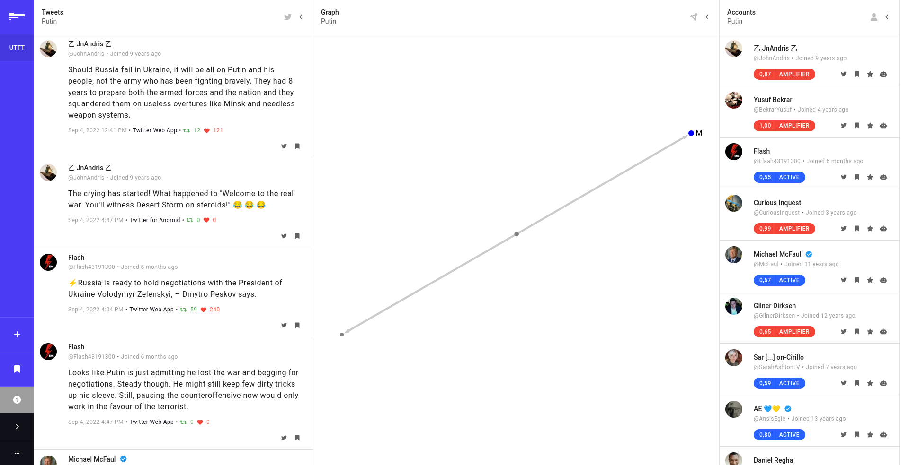

# RTAA&mdash;72

Target Audience Analysis (TAA), as described by many field manuals such as [FM 33-1-1](https://fas.org/irp/doddir/army/fm3-05-301.pdf), is the transitional phase where PSYOP planning moves toward execution, where all communications must be tailored to the local dynamics of the targeted audience in order to be successhfull. In conjuction with modern infromation warfare, which is about corrupting information processing systems and the way they operate, any social media such as Twitter, can be used to distribute and disseminate information in order to manipulate public opinion more efficient, more accurate and in real-time get the feedback and adapt to the conditions. A way to interrupt this proccess is by continuosly monitor these elements (distributors and messages), or at least establish a transparent mechanism to do so.

***Reverse* Target Audience Analysis**, is [CVCIO](https://cvcio.org)'s real-time intelligence dashboard, where we try to reverse engineer this process, by tracking inauthentic account activity and the narratives they are trying to push forward.

*RTAA&mdash;72 was created during [Bellingcat](https://www.bellingcat.com/)'s Hackathon on September 2022.*



## Features

- Real-time Twitter streaming.
- Network Visualization with [sigmajs](https://www.sigmajs.org/), and [graphology](https://graphology.github.io/).
- [Gephi](https://gephi.org/) support via Websockets.
- (Optional) Account Classification via [rtaa-classifier](https://github.com/cvcio/rtaa-classifier).
- (Optional) Tweet Classification via [rtaa-classifier](https://github.com/cvcio/rtaa-classifier).

While this is just a prototype, we plan to support, data indexing with Elasticsearch, Bookmarks, Exports to various formats, more text-classification pipeline, Meme extraction and classification, a collaboration mechanism, and any other suggestion of the community. If you have any, please let us know at info@cvcio.org.

## Installation

```bash
git clone git@github.com:cvcio/rtaa-72.git
cd rtaa-72
```

## Usage

Before using the services you need to obtain an Api Key / Secret from Twitter in order to connect to the streaming service. Navigate to [https://developer.twitter.com/en/portal/dashboard](https://developer.twitter.com/en/portal/dashboard), create a new application, and set the `TWITTER_CONSUMER_KEY` with the Api Key generated by Twitter and `TWITTER_CONSUMER_SECRET` with the secret into the environment variables.

To run RTAA&mdash;72 it is highly suggested to use docker and docker-compose. Please read the official [instrucions](https://docs.docker.com/engine/install/) on how to install. Afterwards you can edit the environment variables in `docker-compose.yaml` and start the services. Keep a note that by default it will also start the [classification]() service, which is optional, and depends on multiple models served via [Huggingface](https://huggingface.co/).

```bash
make services-run
```

## Contribution

If you're new to contributing to Open Source on Github, [this guide](https://opensource.guide/how-to-contribute/) can help you get started. Please check out the contribution guide for more details on how issues and pull requests work. Before contributing be sure to review the [code of conduct](https://github.com/cvcio/rtaa-classifier/blob/main/CODE_OF_CONDUCT.md).

<a href="https://github.com/cvcio/rtaa-classifier/graphs/contributors">
  
</a>

## License and Attribution

In general, we are making this software publicly available for broad, noncommercial public use, including academics, journalists, policymakers, researchers and the public in general.

If you use this service, please let us know at [info@cvcio.org](mailto:info@cvcio.org).

See our [LICENSE](https://github.com/cvcio/covid-19-api/blob/main/LICENSE.md) for the full terms of use for this software.